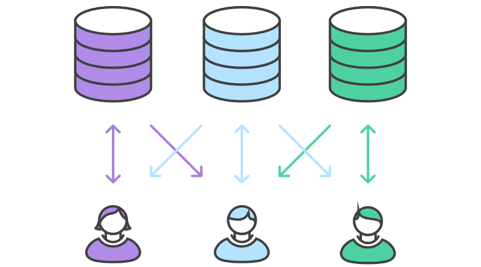
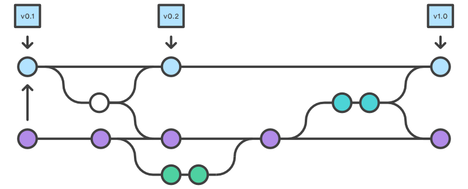
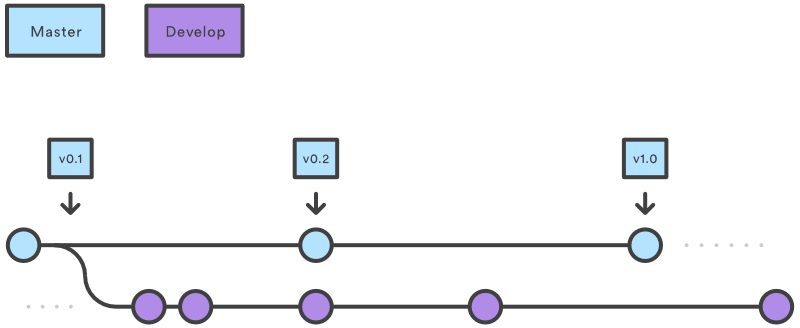
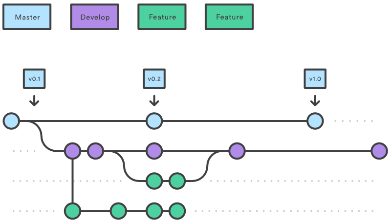
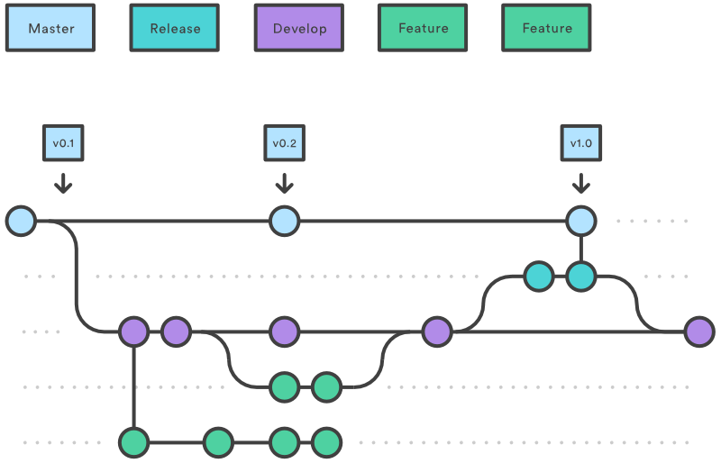
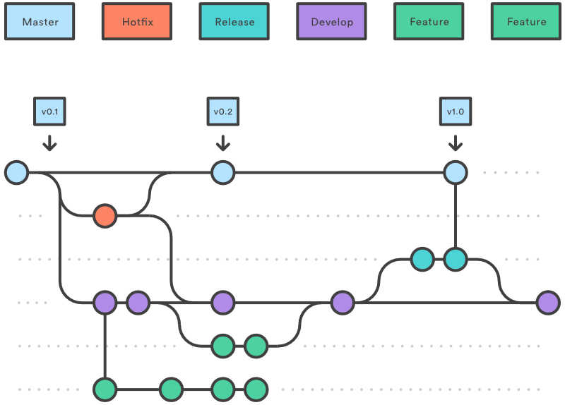

# How To Participate In The Project&rsquo;s Workflow

---

Version 1.0.0

Any software or document project needs a way to control and keep track of all the changes that occur within the project over time &mdash; to keep track of the different versions of the Project&rsquo;s products. In the FGI Project we use Git as our version control mechanism and we take advantage of the Cloud by hosting the Project on [GitHub](https://github.com/Dulux-Oz/FGI).

## Git And GitKraken

Git itself is a piece of software that you install on your computer. The purpose of Git is to manage a project, or a set of files, as they change over time. Git stores this information in a data structure called a *Repository* (often abbreviated to *repo*).

If you&rsquo;ve never used Git and GitHub before it can seem a bit daunting at first, but believe us, it quickly becomes second nature and you&rsquo;ll soon be wondering how else you can use the powerful features of the Git version control system for other things. We&rsquo;ve tried to make things as simple and as easy as we can by providing a series of simple *How To* documents which explain, in Step-by-Step processes, how to perform each task. Of course, if you&rsquo;re an old hand at Git and GitHub then you can simply go over the higher-level explanation documents and skip the individual *How To&rsquo;s*.

Git doesn&rsquo;t have a Graphic User Interface (GUI) and so it is controlled by typing commands in at the Command Line. There are, however, other programs which do have a GUI that you can install and use instead of Git that utilise the Git architecture, thus making it a lot easier to use and even see what is going on in a git repository. One of these programs is [GitKraken](https://www.gitkraken.com/), and because of its easy of use, availability on all computer platforms (Windows, Linux, and Mac), seemless integration with GitHub and GitHub&rsquo;s Issue Tracker, etc, and its cost (free!) GitKraken is the Git-Client software recommended by the Project. All of the Project&rsquo;s *How To&rsquo;s* are written assuming you are using GitKraken, but we&rsquo;ve also included the Command Line Git commands as well (for those who prefer that style of working).

GitKracken, GK-Boards, and several other useful Programs can be downloaded from the Project&rsquo;s [Tools](Tools.md) Document.

### A Git Glossary

We&rsquo;ve provided a brief [Glossary](Glossary.md) of terms commonly used with Git (and GitKraken) to help out those who aren&rsquo;t quite sure what any given term means.

## The Project&rsquo;s FGI-Workflow

There are a number of different ways of using Git, GitKracken, GK-Boards, and GitHub that have been developed over the last few years, each method known as a *workflow*. For those of you already familiar with working with git workflows the FGI Project uses a hybrid workflow consisting of a mix of the Forking Workflow and the Gitflow Workflow. The Gitflow Workflow is a Git workflow design that was first published and made popular by [Vincent Driessen at nvie](http://nvie.com/posts/a-successful-git-branching-model/).

For simplicity we call this hybrid workflow the *FGI-Workflow*.

In the FGI-Workflow, each Contributor has their own copy of the Project&rsquo;s git repository (the Project&rsquo;s files and documents) stored on GitHub, known as their *public repository*. Each Contributor also has a copy of the Project&rsquo;s repository stored on their local computer, known as their *private repository*. Each of these repositories is keep synchronised with the *master* or *official repository* controlled by the Project&rsquo;s Maintainer(s).

Like the Gitflow Workflow, the FGI-Workflow defines a strict branching model within each individual repository. It assigns very specific roles to different branches within the repository and defines how and when they should interact.

The core idea behind this is that all of the activities that occur within the Project, such as feature development, bug fixes, and release preparations, should take place in their own dedicated branch. These branches can then be merged back into the &ldquo;offical&rdquo; `master` and the &ldquo;offical&rdquo; `develop` branches when ready. This encapsulation makes it easy for multiple Contributors to work on a particular feature without disturbing the rest of the Project. It also means the &ldquo;offical&rdquo; `master` branch will never contain broken code or unfinished documents, and that the &ldquo;offical&rdquo; `develop` branch never holds code or documents that have not been approved by the Project&rsquo;s Maintainers.

The reason we use this workflow is that contributions can be integrated without the need for everybody to have write access to the official repository. Contributors submit new and edited documents and program files to their own public server-side repositories (known as *pushing*), and only the Project Maintainers can push to the official master repository. This allows the Maintainers to accept changes (known as *commits*) from any Contributor without giving them write access to the official manuscripts or codebase.

The result is a distributed workflow that provides a flexible way for large, organic teams to collaborate securely. It&rsquo;s an ideal workflow for projects such as ours.

## How It Works

### 1. Initial Repository Setup

The FGI-Workflow begins with an official public repository stored on a server (in our case, the GitHub Server at [https://github.com/Dulux-Oz/FGI](https://github.com/Dulux-Oz/FGI)). When a new repository is first initialised it normal begins with a single branch called `master`. However, the FGI-Workflow has two branches to record the history of the project. The `master` branch stores the official release history, and the `develop` branch serves as an integration branch for features. It&rsquo;s also convenient to tag all commits in the `master` branch with a [SemVer+]((Semantic_Versioning_Plus.md) version number.

 
### 2. Getting Started

When a new Contributor wants to start working on the Project, they *Fork* the official repository to create a copy of it on the GitHub server. This new copy serves as their personal public repository &mdash; no other Contributors are allowed to push to it, but they can pull changes from it (we&rsquo;ll see why this is important in a moment).

After they have created their server-side copy, the Contributor *clones* the repository to get a copy of it onto their local machine, and then initialises *GitFlow* on the cloned copy. This serves as their private development environment.

**Project Conventions:**

- Fork Off Of: Official Repository
- Clone From: New private server-side repository

**Further Information:**

- [How To Fork The Project](How_To_Fork_The_Project.md)
- [How To Clone A Repository](How_To_Clone_A_Repository.md)

### 3. Feature Branches

Each new feature or document-set should reside in its own branch. But, instead of branching off of `master`, feature branches use `develop` as their parent branch. Feature branches should have descriptive names, like `animated-menu-items` or `issue-#1061`. The idea is to give a clear, highly-focused purpose to each branch.

This is all done on your local copy of the repository.

On this new branch, the Contributor edits, stages, and commits changes, building up the feature with as many commits as necessary.

When the feature is ready, the Contributor *pushes* the local commits to their own public server-side repository (and see also Step 4, below).

Branches can also be pushed to the Contributor&rsquo;s public repository on the GitHub server for backup and/or collaboration. 

If you get stuck in the middle of a feature, you can open a *pull request* asking for suggestions from other Contributors.

You can think of pull requests as a discussion dedicated to a particular branch. If a Contributor needs help with a particular feature, all they have to do is file a pull request. Interested parties will be notified automatically, and they’ll be able to see the question right next to the relevant commits.

**Project Conventions:**

- Branch Off Of: Contributor&rsquo;s local copy of `develop`
- Naming Convention: `feature/*`

**Further Information:**

- [How To Create A Branch](How_To_Create_A_Branch.md)
- [How To Stage A Change](How_To_Stage_A_Change.md)
- [How To Commit A Change](How_To_Commit_A_Change.md)
- [How To Push A Commit](How_To_Push_A_Commit.md)
- [How To File A Pull Request](How_To_Document_A_Pull_Request.md)

### 4. Getting The Commit Into The Official Repository

Once the Contributor has their feature ready to be included in the official repository they file a pull request with the official repository, which lets the Project Maintainer(s) know that an update is ready to be integrated. The pull request also serves as a convenient discussion thread if there are issues with the contributed document or code.

To integrate the new work into the official repository, one of the Project Maintainers *pulls* the Contributor&rsquo;s changes into their local repository, checks to make sure it doesn&rsquo;t break the Project, merges it into their local `develop` branch, then pushes the `develop` branch to the official repository on the server.

**Project Conventions:**

- File Pull Request To: Official Repository
- Pull From: Contributor&rsquo;s public server-side repository
- Merge Into: `develop`
- Push To: Official Repository

**Further Information:**

- [How To File A Pull Request](How_To_Document_A_Pull_Request.md)
- [How To Pull From A Repository](How_To_Pull_From_A_Repository.md)

### 5. Synchronisation

The contribution is now part of the Project, and other Contributors should pull from the official repository to synchronise their local repositories.

**Project Conventions:**

- Pull From: Official Repository

**Further Information:**

- [How To Pull From A Repository](How_To_Pull_From_A_Repository.md)

### 6. Release Branches

Once the official repository&rsquo;s `develop` branch has acquired enough features for a release (or a predetermined release date is approaching), the Project&rsquo;s Release Manager creates a release branch off of `develop` (in their own, local copy of the repository, after making sure their local copy is fully synchronised with the official repository). Creating this branch starts the next release cycle, so no new features can be added after this point — only bug fixes and other release-oriented tasks should go in this branch. Once it&rsquo;s ready to be deployed, the release gets merged into `master` and tagged with a [SemVer](http://semver.org) or a [SemVer+](Semantic_Versioning_Plus.md) version number as appropriate. In addition, the branch should also be merged back into `develop`, which may have progressed since the release was initiated. Other Contributors should now pull from the official repository to synchronise their local repositories.
=======

Using a dedicated branch to prepare releases makes it possible for the Release Manager (and their team, if one exists) to polish the current release while other teams and individuals continues working on features for the next release. It also creates well-defined phases of development (eg it&rsquo;s easy to say, &ldquo;this week we&rsquo;re preparing for version 4.0&rdquo; and to actually see it in the structure of the repository).

**Common Conventions:**

- Branch Off Of: `develop`
- Merge Into: `master` and `develop`
- Push To: Official Repository
- Naming Convention: `release/*`

**Further Information:**

<<<<<<< HEAD
- [How To Perform A Release](How_To_Perform_A_Release.md)

### 7. Maintenance Or &ldquo;Hotfix&rdquo; Branches

Maintenance or &ldquo;hotfix&rdquo; branches are used to quickly patch production releases. They work the same as feature branches and anyone can work on a maintenance branch (not just the Project Maintainer(s)). However, maintenance branches branch directly off of `master` (and are the only branches to do so).

As soon as the fix is complete, a pull request should be filed with the official repository and one of the Project Maintainers will then review it and merge it into both `master` and `develop` (or the current release branch), and `master` will be tagged with an updated [SemVer](http://semver.org) or a [SemVer+](Semantic_Versioning_Plus.md) version number as appropriate. Other Contributors should now pull from the official repository to synchronise their local repositories.
=======
- [How To Perform A Release](https://github.com/Dulux-Oz/FGI/tree/master/Project_Documentation/How_To_Perform_A_Release.md)

### 7. Maintenance Or &ldquo;Hotfix&rdquo; Branches

Maintenance or &ldquo;hotfix&rdquo; branches are used to quickly patch production releases. They work the same as feature branches and anyone can work on a maintenance branch (not just the Project Maintainer(s)). However, maintenance branches branch directly off of `master` (and are the only branches to do so).

As soon as the fix is complete, a pull request should be filed with the official repository and one of the Project Maintainers will then review it and merge it into both `master` and `develop` (or the current release branch), and `master` will be tagged with an updated [SemVer](http://semver.org) or a [SemVer+](https://github.com/Dulux-Oz/FGI/tree/master/Project_Documentation/Semantic_Versioning_Plus.md) version number as appropriate. Other Contributors should now pull from the official repository to synchronise their local repositories.
>>>>>>> develop

Having a dedicated line of development for bug fixes lets Contributors address issues without interrupting the rest of the workflow or waiting for the next release cycle.

**Common Conventions:**

- Branch Off Of: `master`
- File Pull Request To: Official Repository
- Pull From: Contributor&rsquo;s public server-side repository
- Merge Into: `master` and `develop`
- Push To: Official Repository
- Naming Convention: `hotfix/*`

### Project Workflow Example

This [link](Project_Workflow_Example.md) will take you to an example of using the FGI-Workflow.

---

If you have any further questions or require any further help, please see the Project&rsquo;s [FAQs](FAQs.md) Document, or don&rsquo;t hesitate to email the Project on <fgi@freelists.org>.

## Attribution

Material paraphrased from and originally published by Atlassian (https://www.atlassian.com/git/tutorials) and released under a [Creative Commons Attribution 2.5 Australia (CC BY 2.5 AU) License](http://creativecommons.org/licenses/by/2.5/au/).

---

Unlike with most other Images in the FGI Project, Images within this work are licensed under a [Creative Commons Attribution-ShareAlike 4.0 International (CC BY-SA 4.0) License.](https://creativecommons.org/licenses/by-sa/4.0/)

This work is Copyright &copy;2004-2020 PEREGRINE I.T. Pty Ltd and is licensed under a [Creative Commons Attribution-ShareAlike 4.0 International (CC BY-SA 4.0) License.](https://creativecommons.org/licenses/by-sa/4.0/)

All Rights Reserved.
