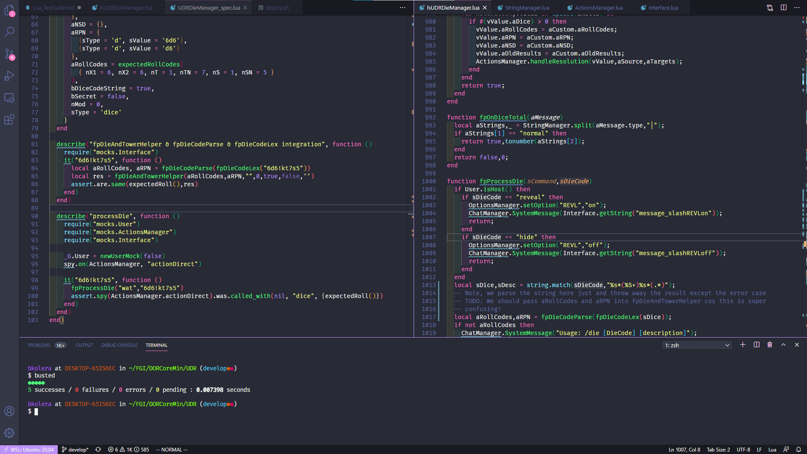

# Lua Test Suite / Development Environment

__This is an early draft as the test suite is being created.__

## Installation Instructions

### Windows 10
- Install WSL2 & Ubuntu 20.04: https://wiki.ubuntu.com/WSL
- Install vscode for windows: https://code.visualstudio.com/Download
  - Install "Remote WSL" and the "Lua" Language server
- Open up a Ubuntu 20.04 terminal by opening "Ubuntu 20.04" from start menu:
  - `sudo apt install git lua5.3 lua-busted lua-inspect`
  - `git checkout git@github.com:Dulux-Oz/FGI`
	- `cd FGI`
	- `code` and follow prompts to install the WSL server
- Open up a terminal in the vscode window by going to the menu "Terminal > New Terminal"
  - `cd DORCoreMin/UDR`
	- `busted`
	- You should see the tests run in vscode like this: 
	- If that all works, you ought to be able to just hit Ctrl-Shift-B while editing a lua file to run the tests!