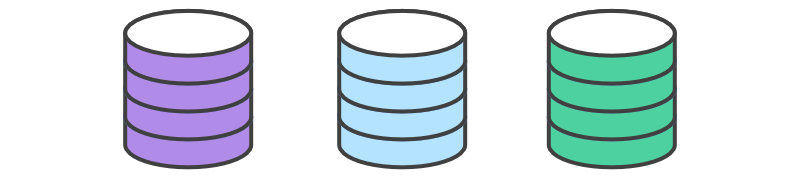
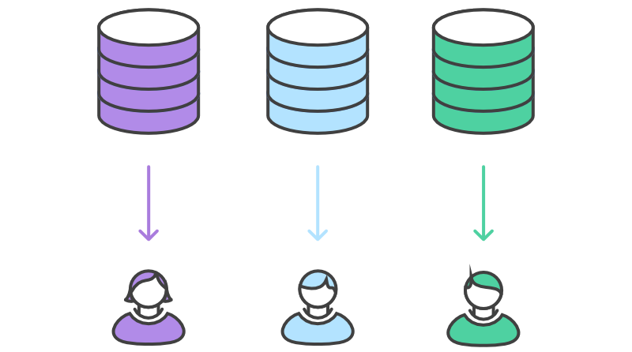
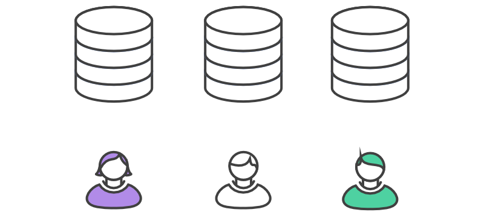
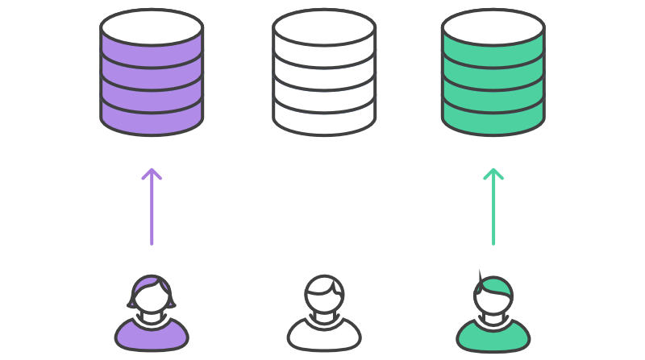
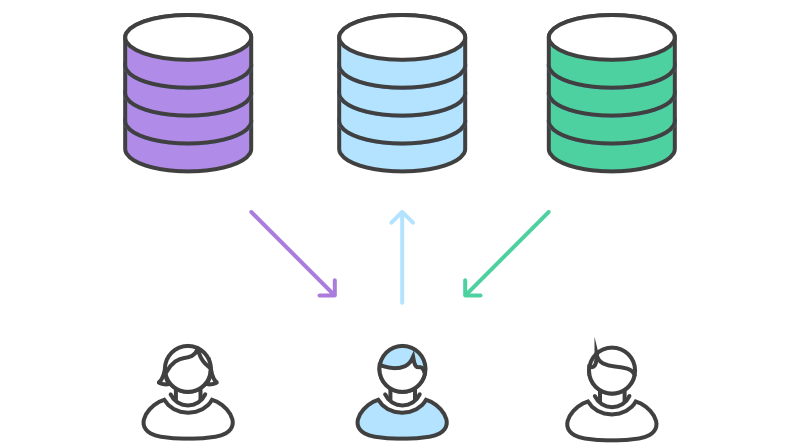
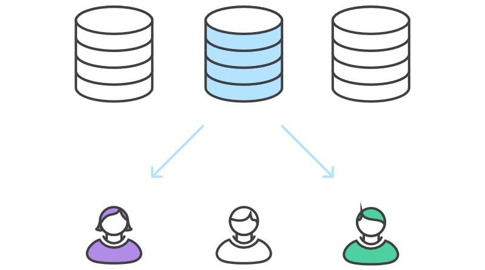

# FGI-Workflow Example

---

Version 1.0.0

Here is an example of how the FGI-Workflow works. 

<<<<<<< HEAD
If you have any further questions or require any further help, please see the Project&rsquo;s [FAQs](FAQs.md) Document, or don&rsquo;t hesitate to email the Project on <fgi@freelists.org>.

### 1. Bill (one of the Project Maintainers) initialises the official repository.

=======
If you have any further questions or require any further help, please see the Project&rsquo;s [FAQs](https://github.com/Dulux-Oz/FGI/tree/master/Project_Documentation/FAQs.md) Document, or don&rsquo;t hesitate to email the Project on <fgi@freelists.org>.

### 1. Bill (one of the Project Maintainers) initialises the official repository.

>>>>>>> develop

As with any Git-based project, the first step is to create an official repository on a server publicly accessible to everyone.

### 2. John and Mary (two of the Project&rsquo;s Contributors) fork the official repository.

<<<<<<< HEAD

=======

>>>>>>> develop

Next, John and Mary (and all of the other Contributors) need to fork this official repository into their own public GitHub account. Because we use GitHub to host our public repositories, each Contributor will need to have their own GitHub account.

### 3. Contributors clone their forked repositories.

<<<<<<< HEAD

=======

>>>>>>> develop

Next, each Contributor clones their own public repository to a private, local one and initialises *GitFlow* on it.

Whereas other workflows require a single `origin` remote that points to the official repository, the FGI-Workflow requires two remotes &mdash; one for the official repository, and one for the Contributor&rsquo;s personal server-side repository. While you can call these remotes anything you want, a common convention is to use `origin` as the remote for your personal server-side repository and `upstream` for the official repository &mdash; however our Project uses the name `Official_FGI_Upstream` just to make things just a little more clear.

It is also possible to have other remotes, typically the public repositories of other Contributors that you may be collaborating with.

### 4. John and Mary work on their features.

<<<<<<< HEAD

=======

>>>>>>> develop

Our example really gets started with John and Mary working on separate features. 

#### 4a. Mary starts her feature.

<<<<<<< HEAD

=======

>>>>>>> develop

In the local repository that she just cloned, Mary creates a new feature branch from the `develop` branch and calls it `marys_feature`.

She then add commits to the feature branch in the usual fashion: edit, stage, commit.

(Incidentally, `marys_feature` is not a very good name for a feature branch, as it doesn&rsquo;t convey what the feature is or does &mdash; but for the purposes of this example the name makes sense so that we can follow along with what&rsquo;s happening.)

#### 4b. Mary finishes her feature.

<<<<<<< HEAD

=======

>>>>>>> develop

After adding a few commits, Mary decides her feature is ready. She makes sure her local `develop` branch is up to date by pulling from the official repository. Then she mergers her feature branch into her `develop` branch. If there are any conflicts she resolves them. Once everything is correct Mary pushes to her public server-side repository.

#### 4c. Meanwhile, John is doing the exact same thing.

While Mary is working on `marys-feature`, John is doing the exact same thing with his own feature branch. By isolating features into separate branches, everybody can work independently, yet it&rsquo;s still trivial to share changes with other developers when necessary. All of the changes will be entirely private until they push them to their public repository.

<<<<<<< HEAD

=======

>>>>>>> develop

### 5. Filing the pull request.

Now that Mary has a feature ready to be included in the official repository, she needs to notify the Project Maintainers so that they can perform the actual merge. She does this by filing a pull request on the official repository.

### 6. Bill integrates John&rsquo;s and Mary&rsquo;s features.

When the the Project Maintainers receives the pull request, their job is to decide whether or not to integrate it into the official repository. Bill needs to fetch the `marys_feature` branch from Mary&rsquo;s server-side repository, merge it into his local `develop` branch, and resolve any conflicts.

<<<<<<< HEAD

=======

>>>>>>> develop

Bill gets the pull request and takes a look at `marys-feature`. He decides he wants to make a few changes before integrating it into the official project, and he and Mary have some back-and-forth via the pull request.

To make the changes suggested by Bill, Mary uses the exact same process as she did to create the first iteration of her feature. She edits, stages, commits, and pushes updates to her public server-side repository. All of her activity shows up in the pull request, and Bill can still make comments along the way.

If he wanted, Bill could also work on `marys-feature` on his own local copy. Any commits he added would also show up in the pull request.

Once the changes are integrated into his local `develop` branch, Bill needs to push it to the official repository on the GitHub server so that other Contributors can access it.

Mary&rsquo;s contribution is now fully integrated into the project.

### 7. John and Mary synchronise with the official repository.

<<<<<<< HEAD

=======

>>>>>>> develop

Since the offical repository has moved forward, other Contributors (not just John and Mary) need to synchronise with the official repository.

### 8. The Project&rsquo;s Release Manager begins to prepare a release.

<<<<<<< HEAD

=======

>>>>>>> develop

While John and Mary are still working on their features, the Project&rsquo;s Release Manager starts to prepare the first official release of the Project. Like feature development, he uses a new branch (called `Release v1.0.0`) to encapsulate the release preparations on his own private local copy of the repository. This step is also where the release&rsquo;s version number is established.

This branch is a place to clean up the release, test everything, make sure the documentation is up to date, and do any other kind of preparation for the upcoming release. It&rsquo;s like a feature branch dedicated to polishing the release, and all of the steps normally taken for a feature branch are also taken for a release branch.

As soon as the Release Manager creates this branch and pushes it to the official repository, the release is feature-frozen. Any functionality that isn&rsquo;t already in develop is postponed until the next release cycle.

### 9. The Project&rsquo;s Release Manager finishes the release.

<<<<<<< HEAD

=======

>>>>>>> develop

Once the release is ready to ship, the Project&rsquo;s Release Manager merges it into the official repository&rsquo;s `master` and `develop` branches, then deletes the `Release v1.0.0` release branch if desired. It&rsquo;s important to merge back into `develop` because critical updates may have been added to the release branch and they need to be accessible to new features.

Release branches act as a buffer between feature development (`develop`) and public releases (`master`). Whenever we merge something into `master`, we need to tag the commit for easy reference.

### 10. End-user discovers a bug.

<<<<<<< HEAD

=======

>>>>>>> develop

After the release is posted, Mary is still developing features for the next release with John. That is, until an end-user opens a ticket complaining about a bug in the current release. To address the bug, Mary (or John) creates a maintenance branch (called `Issue #1`) off of their local copy of the `master` branch, fixes the issue with as many commits as necessary, pushes the branch to her public server-side repository, then files a pull request on the official repository.

Bill sees the pull request and, after checking that everything is correct, merges the maintenance branch (`Issue #1`) directly back into `master`. Like release branches, maintenance branches contain important updates that need to be included in `develop`, so Bill performs that merge as well. Then, he&rsquo;s free to delete the maintenance branch.

## Final Thoughts

This article explained how a contribution flows from one Contributor into the official `master` branch, but the same methodology can be used to integrate a contribution into any repository. For example, if one part of our team is collaborating on a particular feature, they can share changes amongst themselves in the exact same manner — without touching the official repository &mdash; any Contributor can easily share changes with any other Contributor.

<<<<<<< HEAD
If you have any further questions or require any further help, please see the Project&rsquo;s [FAQs](FAQs.md) Document, or don&rsquo;t hesitate to email the Project on <fgi@freelists.org>.
=======
If you have any further questions or require any further help, please see the Project&rsquo;s [FAQs](https://github.com/Dulux-Oz/FGI/tree/master/Project_Documentation/FAQs.md) Document, or don&rsquo;t hesitate to email the Project on <fgi@freelists.org>.
>>>>>>> develop

## Attribution

Material originally published by Atlassian (https://www.atlassian.com/git/tutorials) and released under a [Creative Commons Attribution 2.5 Australia (CC BY 2.5 AU) License](http://creativecommons.org/licenses/by/2.5/au/).

---

Unlike with most other Images in the FGI Project, Images within this work are licensed under a [Creative Commons Attribution-ShareAlike 4.0 International (CC BY-SA 4.0) License.](https://creativecommons.org/licenses/by-sa/4.0/)

This work is Copyright &copy;2004-2020 PEREGRINE I.T. Pty Ltd and is licensed under a [Creative Commons Attribution-ShareAlike 4.0 International (CC BY-SA 4.0) License.](https://creativecommons.org/licenses/by-sa/4.0/)

All Rights Reserved.
